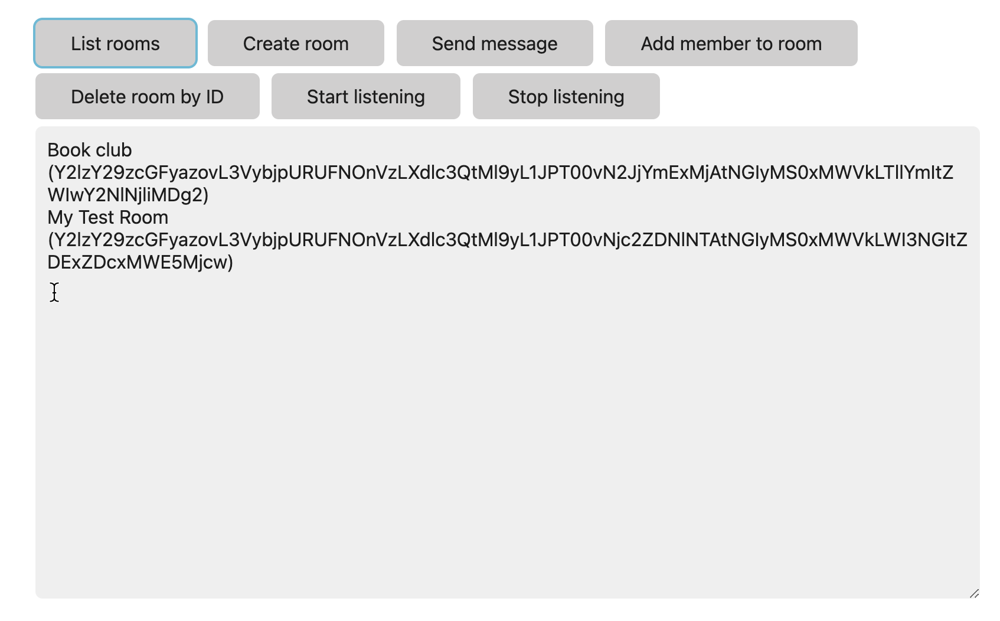

# Browser SDK Messaging Sample app

This sample shows how to use the Webex Browser SDK to make API call and display results. It accompanies a [tutorial](https://developer.webex.com/docs/browser-sdk-messaging-tutorial) on the Webex Developer Portal that you can follow along with.

