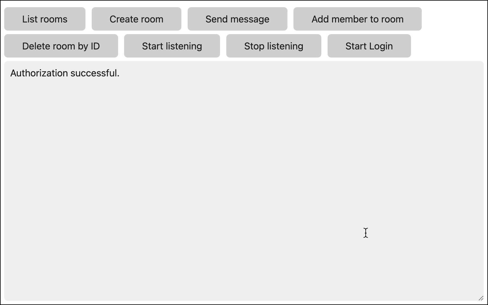

# Browser SDK Messaging Sample app

This sample shows how to use the Webex Browser SDK to make API call and display results. It accompanies a [tutorial](https://developer.webex.com/docs/browser-sdk-messaging-tutorial) on the Webex Developer Portal that you can follow along with.


To use the completed app you need to obtain use your [personal access token](https://developer.webex.com/docs/getting-your-personal-access-token) from the Developer Portal that the SDK will use to make API calls.

> In a production environment you will want to create a Webex Integration (OAuth client) that will obtain an API access token for the authenticating Webex user.

Add your personal access token to index.js:

```javascript
const webex = (window.webex = window.Webex.init({
    credentials: {
        access_token: "<YOUR-PERSONAL-ACCESS_TOKEN>"
    }
}));
```

Save your changes and load index.html in a browser and you should see a "Authentication successful" message.

